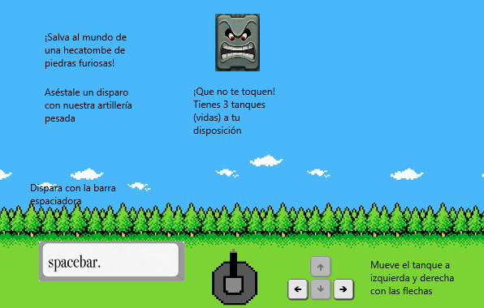

# MiniProyecto-Videojuego en C con SDL2 "Piedras Picudas" - Instrucciones de Compilación



Este proyecto es una versión adaptada del mítico Space Invaders. Aquí se detallan los pasos necesarios para compilar y ejecutar la aplicación en **Windows** y **Linux**.

## Requisitos

### Windows
- **Compilador de C para Windows**: Como MSVC, Clang, Cygwin...Se puede utilizar el que se desee, aquí se detalla como hacerlo con el compilador MinGW que incluye el IDE [Code::Blocks](https://www.codeblocks.org/)
- **[SDL2](https://wiki.libsdl.org/SDL2/Installation)** para Windows

### Linux
- **Code::Blocks** (opcional, también se puede compilar desde terminal).
- **SDL2** (en la mayoría de distribuciones, instalable desde su gestor de paquetes).
- **GCC** (incluido en la distribución).

---

## Compilación en Windows

A continuación se indican una serie de pasos para llevar a cabo la compilación mediante Code::Blocks:

1. **Descargar e instalar Code::Blocks:**
   - Descarga desde la web de [Codeblocks](https://www.codeblocks.org/downloads/binaries/) el instalador que incluya MinGW (`codeblocks-X.Xmingw-setup.exe`) y sigue el proceso de instalación.

2. **Descargar y configurar SDL2:**
   - Descarga la versión de [SDL2 para Windows](SDL2-devel-2.X.X-mingw.tar.gz) (`SDL2-devel-2.X.X-mingw.tar.gz`) y descomprímela.
   - Copia el archivo `SDL2.dll` (ubicado en `SDL2-2.X.X\i686-w64-mingw32\bin`) a las siguientes carpetas:
     - `C:\Windows\System32`
     - `C:\Windows\SysWOW64`
   - Copia el contenido de la carpeta `SDL2-2.X.X\i686-w64-mingw32\lib` a la carpeta de librerías de Code::Blocks:
     - `C:\Archivos de programa (x86)\CodeBlocks\MinGW\lib`
   - Copia la carpeta `SDL2` de `SDL2-2.X.X\i686-w64-mingw32\include` a la carpeta de includes:
     - `C:\Archivos de programa (x86)\CodeBlocks\MinGW\include`

3. **Configurar Code::Blocks:**
   - Abre Code::Blocks y carga o crea tu proyecto.
   - Ve a **Settings → Compiler...** y, en la pestaña **Compiler Settings**, agrega en **Other options**:
     ```
     -std=c99
     ```
   - En la pestaña **Linker Settings**, en **Other linker options**, agrega:
     ```
     -lmingw32 -lSDL2main -lSDL2
     ```
   - Verifica en la pestaña **Toolchain executables** que la ruta apunte al compilador MinGW de Code::Blocks (por ejemplo, `C:\Program Files (x86)\CodeBlocks\MinGW`).

4. **Compilar y ejecutar:**
   - Compila el proyecto y ejecuta la aplicación. Asegúrate de que `SDL2.dll` se encuentre en las rutas correctas para la ejecución.

---

## Compilación en Linux

1. **Instalar las dependencias:**
   Abre una terminal y ejecuta según tu distribución:

   **Fedora**
   ```bash
   sudo dnf install codeblocks SDL2 SDL2-devel
   ```
   **Ubuntu** / **Debian**
   ```bash
   sudo apt update
   sudo apt install codeblocks libsdl2-dev
   ```
   **Arch Linux** / **Manjaro**
   ```bash
   sudo pacman -S codeblocks sdl2 sdl2_image sdl2_ttf sdl2_mixer
   ```
   **OpenSUSE**
   ```bash
   sudo zypper install codeblocks SDL2-devel
   ```
3. **(Opción 1) Usando Code::Blocks:**
   - Abre Code::Blocks y carga o crea tu proyecto.
   - Ve a **Settings → Compiler...** y, en la pestaña **Compiler Settings**, agrega en **Other options**:
     ```
     -std=c99
     ```
   - En la pestaña **Linker Settings**, en **Other linker options**, agrega:
     ```
     `sdl2-config --cflags --libs` -lm
     ```
    - Compila y ejecuta.

4. **(Opción 2) Usando el Makefile incluido**
   - Con la termninal, encontrándose en el directorio raíz que contiene este repositorio ejecuta:
     ```bash
     make
     ```
   - Para eliminar los ficheros residuales de la compilación se puede usar también:
     ```bash
     make clean
     ```
   - Verifica en la pestaña **Toolchain executables** que la ruta apunte al compilador MinGW de Code::Blocks (por ejemplo, `C:\Program Files (x86)\CodeBlocks\MinGW`).
   - Ejecuta con:
     ```bash
     ./piedras_picudas
     ```
     Nota: Asegúrate de tener permisos de ejecución, de no tenerlos hacer:
     ```bash
     chmod +x piedras_picudas
     ```
   
